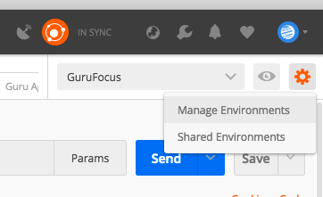
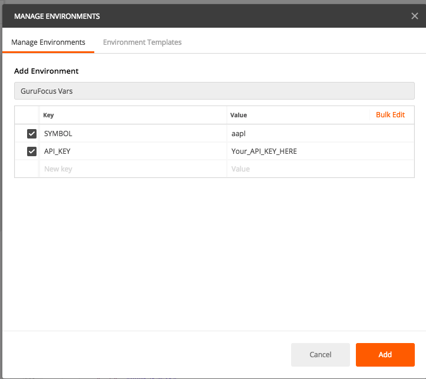

# Guru Focus API

This is a Postman collection for Guru Focus API as defined [here](https://www.gurufocus.com/api.php)

## Usage

* Get your API Token [here](https://www.gurufocus.com/api_user.php)
* Import `GuruFocus.postman_collection.json` into [Postman](https://www.getpostman.com)
* Setup Postman Variable (see below)
* Select the API you would like to use
* Click Send

## API

**Host:** https://www.gurufocus.com

| Name  | Path  | Description  |
|---|---|---|
| News  | /api/public/news/editor/0  |   |
| Insider  | /api/public/news/insider/1  |   |
| Portfolio Details  | /api/public/portfolio_details  |   |
| Financials |/public/user/{{API_KEY}}/stock/{{SYMBOL}}/financials | |
| Key Ratios |/public/user/{{API_KEY}}/stock/{{SYMBOL}}/keyratios | |
| Stock Quote | /public/user/{{API_KEY}}/stock/AAPL/quote | |
| Historical Price | /public/user/{{API_KEY}}/stock/{{SYMBOL}}/price| can also call unadjusted_price|
| Summary | /public/user/{{API_KEY}}/stock/{{SYMBOL}}/summary| |
| RT Guru |/public/user/{{API_KEY}}/stock/{{SYMBOL}}/gurus | |
| Insiders |/public/user/{{API_KEY}}/stock/{{SYMBOL}}/insider | |
|Guru Stock Pick | /public/user/{{API_KEY}}/guru/7/picks/2018-02-06 | |
| Dividend History |/public/user/{{API_KEY}}/stock/{{SYMBOL}}/dividend | |
| Insider Trading | /public/user/{{API_KEY}}/insider_updates | |
|Stock on Exchange |/public/user/{{API_KEY}}/exchange_stocks/NAS | |
|Guru Ag Portfolio |/public/user/{{API_KEY}}/guru/7/aggregated | |
|Exchange List | https://api.gurufocus.com/public/user/{{API_KEY}}/exchange_list | |
|Search Symbol |/api/public/search_company/{{SYMBOL}} | |
|Portfolio Details |/api/public/portfolio_details | |
|Portfolio News |/api/public/portfolio/news/{{PORT_ID}} | |
|Guru List |/public/user/{{API_KEY}}/gurulist | |
| | | |
| | | |
| | | |
| | | |

## Setup Post Man Variables

This is how to setup Postman variables for the Guru Focus REST API calls.

First Select Manage Environments (top right corner of Postman)

Enter the name `GuruFocus Vars` (or whatever you want to call it)
Next add the variables:

* [`API_KEY`](https://www.gurufocus.com/api_user.php) 
* `SYMBOL`

Once complete click `Add`

Select `Guru Focus Vars` from the environment variables.

You are now ready to start using the collection of REST API calls.